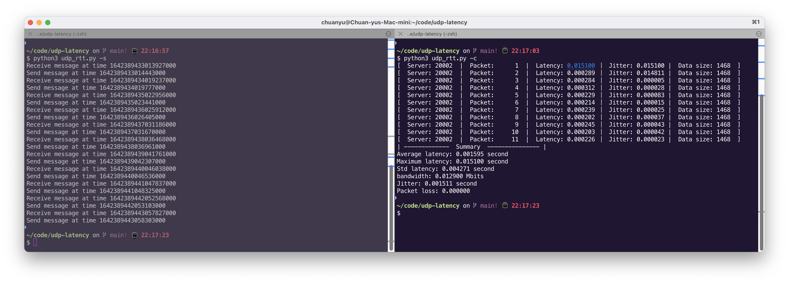
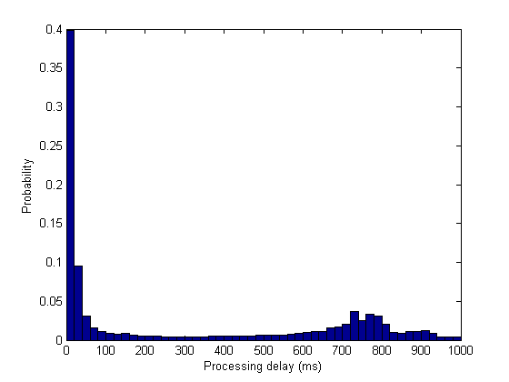

# udp-latency
A single Python file end-to-end latency testing tool based on UDP 📈. 

Support both one-way and round-trip latency measurement:
- `udp_latency.py` measures one-way latency.
- `udp_rrt.py` measures round-trip latency. (both with same arguments)

## Features

Compare with existing latency measuring tools.

|                              | [udp-latency](https://github.com/ChuanyuXue/udp-latency) | [tcp-latency](https://github.com/dgzlopes/tcp-latency) | Ping command | [IPerf](https://iperf.fr) |
| ---------------------------- | -------------------------------------------------------- | ------------------------------------------------------ | ------------ | ------------------------- |
| Support UDP                  | ✅                                                        | ❌                                                      | ❌            | ✅                         |
| Flexible packet size         | ✅                                                        | ❌                                                      | ❌            | ❌                         |
| Flexible bandwidth           | ✅                                                        | ❌                                                      | ❌            | ✅                         |
| Specific sending period      | ✅                                                        | ✅                                                      | ✅            | ❌                         |
| Simple as single Python file | ✅                                                        | ❌                                                      | ❌            | ❌                         |

## Client Usage

`python3 udp_latency.py -c -f/m <frequency / bandwidth> -n <packet size> -t <running time> --ip <remote ip> --port <remote port> --verbose <bool> --sync <bool>`

## Server Usage

`python3 udp_latency.py -s -b <buffer size> --ip <remote ip> --port <local port> --verbose <bool> --sync <bool> --save <records saving path>`

## Arguments

| Argument  | Description                                                                                                                                                                   | Default value |
| --------- | ----------------------------------------------------------------------------------------------------------------------------------------------------------------------------- | ------------- |
| -c        | Client                                                                                                                                                                        | N/A           |
| -s        | Server                                                                                                                                                                        | N/A           |
| -f        | Frequency of sending packets from clients, unit is Hz (number of packet per second). -f “m” means constantly send UDP packets in maximum bandwidth                            | 1             |
| -m        | Bandwidth of sending packets from clients, unit is Mbits. This argument will overwritten -f argument.                                                                         | N/A           |
| -n        | Size of sending packets in clients, unit is bytes. Notes that it is the frame size on wire including IP header and UDP header, the packet size should be within \(44, 1500\]. | 1500          |
| -t        | Client running time, uint is second. The server also stops when client stops running.                                                                                         | 10            |
| -b        | Buffer size in server.                                                                                                                                                        | 1500          |
| --ip      | Remote ip.                                                                                                                                                                    | 127.0.0.1     |
| --port    | To port and local port for client and server respectively.                                                                                                                    | 20001         |
| --verbose | Whether to print the testing result each iteration.                                                                                                                           | True          |
| --sync    | Whether to do the time synchronization in advance.  (only for udp_latency.py)                                                                                                 | True          |
| --dyna    | Whether to use dynamic bandwidth adaption.                                                                                                                                    | True          |
| --save    | File path to save testing result.                                                                                                                                             | ./result.csv  |

## Time synchronization (--sync)

⚠️ Udp-latency (one-way) requires precise synchronization (same clock time) between server and clients. The basic idea for my implementation is from [IEEE PTP](https://en.wikipedia.org/wiki/Precision_Time_Protocol) protocol.

In the first 10 seconds before measurement, PTP events are exchanged per second to calculate **time offset** between the server and clients. To avoid the impact on the experimental traffic, *it stops sending PTP messages during the experiment and neglects the time drifting.*

Udp-rrt doesn't rely on synchronization.

## Dynamic adaption (--dyna)

⚠️  This method will slightly damage the periodicity. (Small jitter contains with this additional bandwidth optimization)

    Due to the non-deterministic delay in `socket.sendto()` system call, it is difficult to maintain a constant sending bandwidth/frequency. For example, you want to send flow in 5 Mbits with `-m` argument (for a 100 byte packet in 1 Gbs linkspeed, you call `socket.sendto` every 2.5 us in Python interpreter), however, the sending speed can be only 3 Mbits when there is an around 1.67 us delay in `socket.sendto()` system call. Furthermore, this delay can be different using kernel scheduling policy and system workload making it hard to bound or estimate (See the following figure about the delay measurement).

To alleviate this problem here, this code uses a greedy method to adjust sending frequency dynamically (like PID control):

$$
NewFrequency = \frac{ExpectedFrequency}{DecayedRate}, ExpectedFrequency = \frac{CurrentFrquency \times RunningTime}{RemaingTime}, DecayedRate = \frac{CurrentFrequency}{Global Frequency}
$$

Where $CurrenctFrequency$ is the accumulated frequency from the program beginning to the current time. $GlobalFrequency$ is the frequency user set with `-f` or `-m` argument. $RunningTime$ and $RemainingTime$ are the time from the programming beginning time and time to the programming ending time defined by `-t` argument respectively.

During the local test through `127.0.0.1`, the gap between realistic and expected bandwidth is bounded within 1%, the difference can be 30% without dynamic adaption.

## Contact

Feel free to contact me at chuanyu.xue@uconn.edu
